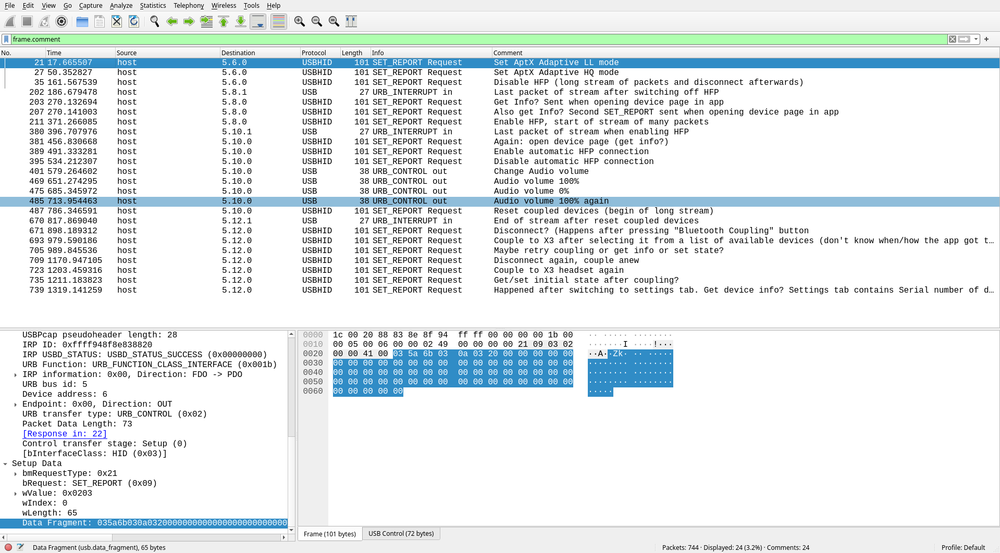

# btw5-switch - a simple script to modify the state of the Creative BT-W5 Bluetooth audio dongle on Linux

## Usage:

0. Install Python and [PyUSB](https://github.com/pyusb/pyusb) (on Debian/Ubuntu: `apt install python3-usb`)
1. Download btw5-switch.py from this repo
2. Make the script executable: `chmod +x btw5-switch.py`
3. Run `sudo ./btw5-switch.py ll`  (for low-latency mode) or `sudo ./btw5-switch.py hq` (for high-quality mode). The color of the light on the BT-W5 should change.

Note: As the script needs to send data to the USB device, you need to either adjust the permissions on the /dev/bus/usb/... device so that you user account has write access to it, or you need to execute it as root (e.g., using sudo, as documented above).

## Creative BT-W5

The Creative BT-W5 is a USB Bluetooth audio dongle.
It is *not* a normal Bluetooth dongle, i.e. it cannot be used for connecting to non-audio devices.
Instead, it acts as an USB audio device towards the computer and as Bluetooth host towards wireless headsets.
In order to configure it, one needs to use one of the official Creative apps or this Python script.

## Protocol

The BT-W5 appears as two USB 'devices' to the computer: an USB sound card (not requiring any driver), and a generic USB HID device.
Configuration of the Bluetooth mode is done by sending data to the HID device.
I have logged the communication between the Creative app on Windows and the BT-5W using [Wireshark](https://www.wireshark.org/) and the [USBPcap](https://github.com/desowin/usbpcap) extension and annotated frames with the actions that I did in the app at that time: [bt-w5.pcapng](bt-w5.pcapng).

## Status

So far, only switching between AptX Adaptive Low Latency (LL) and High Quality (HQ) modes is supported.

The packet capture log includes USB communication for the following actions:

- activate and deactivate HFP mode
- activate and deactivate automatic HFP switching
- disconnect headset
- forget pairings
- pair with headset
- change headset volume

I have not tested whether any of these work so far.
As I don't own a BT-W5 myself, I have little time to implement support for the features above.

If you want to implement e.g. HFP support, check out the packet capture log in Wireshark, look at the payload in the USB packets, and have the Python script send it.
It seems like most commands are similar to the ll/hq switching, so the payload you are sending will/should only differ in a few bytes.

Pull requests welcome.
